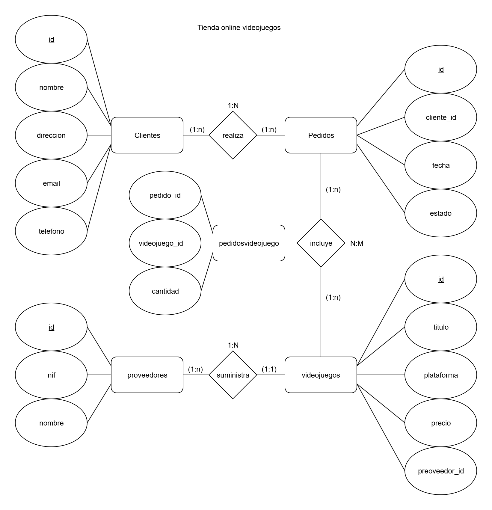

Paso 1: Plantear el Caso de Uso
Caso de Uso: Gestión de una Tienda de Videojuegos

Requisitos:
Gestión de Productos: La tienda vende una variedad de videojuegos. Cada videojuego tiene un título, plataforma, género y precio.

Gestión de Clientes: La tienda tiene una base de datos de clientes que incluye información como nombre, dirección, correo electrónico y número de teléfono.

Gestión de Pedidos: Los clientes pueden realizar pedidos de varios videojuegos. Cada pedido tiene un identificador único, fecha del pedido y estado del pedido (pendiente, enviado, entregado).

Entidades:
Videojuegos:

videojuego_id (Primary Key)

titulo

plataforma

genero

precio

Clientes:

cliente_id (Primary Key)

nombre

direccion

correo_electronico

telefono

Pedidos:

pedido_id (Primary Key)

cliente_id (Foreign Key, referencia a Clientes)

fecha_pedido

estado_pedido

Detalles del Pedido (para la relación N:M entre Pedidos y Videojuegos):

pedido_id (Foreign Key, referencia a Pedidos)

videojuego_id (Foreign Key, referencia a Videojuegos)

cantidad

Paso 2: Crear el Modelo Entidad-Relación con la herramienta GitMind
Diagrama Entidad-Relación (ERD)
Clientes tiene una relación 1:N con Pedidos (un cliente puede realizar múltiples pedidos).

Pedidos tiene una relación N:M con Videojuegos a través de Detalles del Pedido (un pedido puede incluir múltiples videojuegos y cada videojuego puede estar en múltiples pedidos).



Paso 3: Crear la Base de Datos y las Tablas

```
docker-compose up -d
```

```
docker exec -it postgres_container bash
```

```
psql -U postgres
```

```
CREATE DATABASE tiendavideojuegos;
```

Vamos a definir las tablas y sus relaciones en SQL.

```
CREATE TABLE Clientes (
    cliente_id SERIAL PRIMARY KEY,
    nombre VARCHAR(100),
    direccion VARCHAR(255),
    correo_electronico VARCHAR(100),
    telefono VARCHAR(20)
);

CREATE TABLE Videojuegos (
    videojuego_id SERIAL PRIMARY KEY,
    titulo VARCHAR(100),
    plataforma VARCHAR(50),
    genero VARCHAR(50),
    precio DECIMAL(10, 2)
);

CREATE TABLE Pedidos (
    pedido_id SERIAL PRIMARY KEY,
    cliente_id INT REFERENCES Clientes(cliente_id),
    fecha_pedido DATE,
    estado_pedido VARCHAR(50)
);

CREATE TABLE DetallesPedido (
    pedido_id INT REFERENCES Pedidos(pedido_id),
    videojuego_id INT REFERENCES Videojuegos(videojuego_id),
    cantidad INT,
    PRIMARY KEY (pedido_id, videojuego_id)
);
```

Paso 4: Poblar la Base de Datos con Registros
Vamos a insertar algunos datos de ejemplo en las tablas.

```
-- Insertar clientes
INSERT INTO Clientes (nombre, direccion, correo_electronico, telefono)
VALUES
('Juan Pérez', 'Calle Falsa 123', 'juan.perez@example.com', '123456789'),
('María Gómez', 'Avenida Siempre Viva 742', 'maria.gomez@example.com', '987654321');

-- Insertar videojuegos
INSERT INTO Videojuegos (titulo, plataforma, genero, precio)
VALUES
('The Legend of Zelda', 'Nintendo Switch', 'Aventura', 59.99),
('God of War', 'PlayStation 4', 'Acción', 49.99),
('Halo Infinite', 'Xbox Series X', 'FPS', 69.99);

-- Insertar pedidos
INSERT INTO Pedidos (cliente_id, fecha_pedido, estado_pedido)
VALUES
(1, '2024-12-01', 'Pendiente'),
(2, '2024-12-02', 'Enviado');

-- Insertar detalles de pedidos
INSERT INTO DetallesPedido (pedido_id, videojuego_id, cantidad)
VALUES
(1, 1, 1),
(1, 2, 1),
(2, 3, 2);
```

Paso 5: Realizar Consultas para Validar el Modelo

1. Buscar todos los pedidos de un cliente:

```
SELECT p.pedido_id, p.fecha_pedido, p.estado_pedido, c.nombre
FROM Pedidos p
JOIN Clientes c ON p.cliente_id = c.cliente_id
WHERE c.nombre = 'Juan Pérez';
```

pedido_id | fecha_pedido | estado_pedido | nombre  
-----------+--------------+---------------+------------
1 | 2024-12-01 | Pendiente | Juan Pérez
(1 row)

2. Listar todos los videojuegos pedidos en un pedido específico:

```
SELECT v.titulo, v.plataforma, dp.cantidad
FROM DetallesPedido dp
JOIN Videojuegos v ON dp.videojuego_id = v.videojuego_id
WHERE dp.pedido_id = 1;
```

       titulo        |   plataforma    | cantidad

---------------------+-----------------+----------
The Legend of Zelda | Nintendo Switch | 1
God of War | PlayStation 4 | 1
(2 rows)

3. Buscar clientes que han realizado pedidos en una fecha específica:

```
SELECT c.nombre, c.correo_electronico
FROM Clientes c
JOIN Pedidos p ON c.cliente_id = p.cliente_id
WHERE p.fecha_pedido = '2024-12-01';
```

nombre | correo_electronico  
------------+------------------------
Juan Pérez | juan.perez@example.com
(1 row)

4. Listar los videojuegos y la cantidad total pedida de cada uno:

```
SELECT v.titulo, SUM(dp.cantidad) AS total_pedido
FROM Videojuegos v
JOIN DetallesPedido dp ON v.videojuego_id = dp.videojuego_id
GROUP BY v.titulo;
```

       titulo        | total_pedido

---------------------+--------------
Halo Infinite | 2
The Legend of Zelda | 1
God of War | 1
(3 rows)

5. Listar todos los pedidos y sus detalles:

```
SELECT p.pedido_id, c.nombre, v.titulo, dp.cantidad, p.fecha_pedido, p.estado_pedido
FROM Pedidos p
JOIN Clientes c ON p.cliente_id = c.cliente_id
JOIN DetallesPedido dp ON p.pedido_id = dp.pedido_id
JOIN Videojuegos v ON dp.videojuego_id = v.videojuego_id;
```

pedido_id | nombre | titulo | cantidad | fecha_pedido | estado_pedido
-----------+-------------+---------------------+----------+--------------+---------------
1 | Juan Pérez | The Legend of Zelda | 1 | 2024-12-01 | Pendiente
1 | Juan Pérez | God of War | 1 | 2024-12-01 | Pendiente
2 | María Gómez | Halo Infinite | 2 | 2024-12-02 | Enviado
(3 rows)

Archivo SQL: Puedes entregar un archivo .sql con todas las consultas SQL realizadas.
